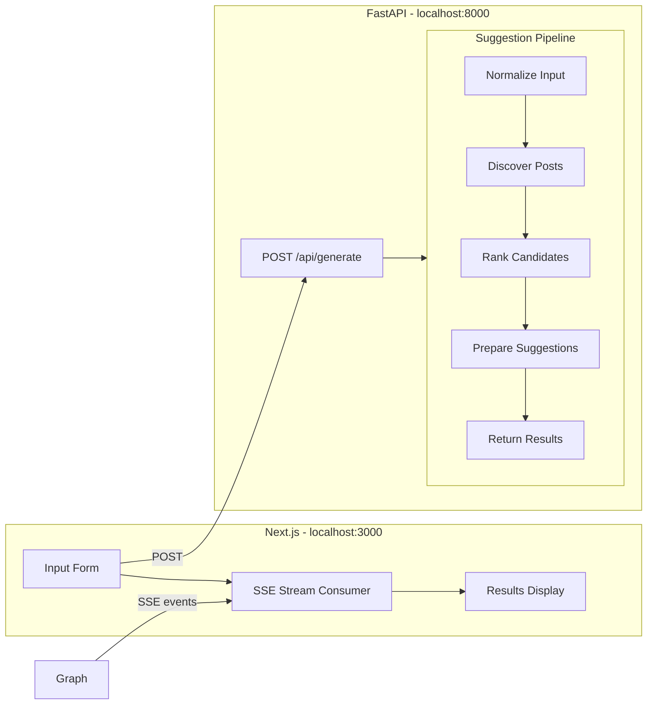

# linkedin-comments-recommender

A full-stack app for finding relevant public LinkedIn posts and drafting comment suggestions in one streamed run.

The current flow is:
- collect structured persona, topic, keyword, and tone input
- discover live public LinkedIn posts through Apify-backed actors
- rank posts by relevance first and engagement second
- return three ranked opportunities with rationale and three copy-ready comment suggestions per post

## Architecture



### Stack

| Layer | Tech |
|-------|------|
| Frontend | Next.js (App Router), TypeScript, Tailwind CSS, shadcn/ui, pnpm |
| Backend | FastAPI, Python 3.12+, LangGraph, langchain-core, uv |
| Discovery | Apify LinkedIn post search + reactions actors |
| LLM | Claude or OpenAI for later comment generation stages |
| Dev | Docker Compose, Makefile |
| CI | GitHub Actions |
| Deploy target | Vercel (frontend) + Railway (backend) |

## Quickstart

### Prerequisites

- Docker and Docker Compose
- An Apify API token
- Optional: an Anthropic or OpenAI API key for later stages

### Steps

```bash
# 1. Clone and enter
git clone <your-repo-url> && cd linkedin-comments-recommender

# 2. Configure
cp .env.example .env
# Edit .env — set APIFY_API_TOKEN

# 3. Run
make dev
```

Open `http://localhost:3000`. Choose a persona, topic, and keywords, then run the LinkedIn suggestion flow.

### Without Docker

```bash
# Backend
cd backend && uv sync --all-extras
uv run uvicorn app.main:app --reload --port 8000

# Frontend (separate terminal)
cd frontend && pnpm install && pnpm dev
```

## How to Customize

This app already uses a LinkedIn-specific contract. If you want to adapt it further, these are the main seams:

### 1. Data Source

Replace or extend the live discovery adapter in `backend/app/services/linkedin_discovery.py`:

```python
class YourDiscoveryAdapter:
    async def discover(self, request: SuggestionRequest) -> list[NormalizedLinkedInPost]:
        # Fetch from your API (Apify, internal DB, etc.)
        ...
```

### 2. Domain Models

Edit `backend/app/models/schemas.py`:
- `SuggestionRequest` — the fields your UI form collects
- `NormalizedLinkedInPost` — the stable internal record from discovery
- `SuggestionResult` — the public API contract returned to the UI

### 3. Graph Nodes

Modify the flow in:
- `backend/app/services/post_ranking.py` — deterministic ranking logic
- `backend/app/services/linkedin_suggestions.py` — rationale and comment suggestion shaping
- `backend/app/graph/pipeline.py` — streamed milestone order

### 4. Frontend

Update `frontend/src/components/generation-form.tsx` to match your new request fields.

### 5. LLM Provider

Set `LLM_PROVIDER=openai` in `.env` and provide `OPENAI_API_KEY`. Update model names in `.env`:

```
GENERATION_MODEL=gpt-4o
EVALUATION_MODEL=gpt-4o-mini
```

## Project Structure

```
├── backend/
│   ├── app/
│   │   ├── api/routes.py          # HTTP endpoints
│   │   ├── graph/
│   │   │   └── pipeline.py        # SSE milestone streaming
│   │   ├── models/schemas.py      # Pydantic models (shared contract)
│   │   ├── services/
│   │   │   ├── linkedin_discovery.py   # Apify-backed post discovery adapter
│   │   │   ├── post_ranking.py         # Deterministic relevance-first ranking
│   │   │   ├── linkedin_suggestions.py # Result shaping + comment placeholders
│   │   │   └── llm.py                  # LLM provider factory
│   │   ├── config.py              # Settings via env vars
│   │   └── main.py                # FastAPI app
│   ├── tests/
│   ├── pyproject.toml
│   └── Dockerfile
├── frontend/
│   ├── src/
│   │   ├── app/page.tsx           # Main page
│   │   ├── components/            # Form, stream display, results
│   │   ├── hooks/                 # SSE stream hook
│   │   └── lib/                   # Types, API config
│   ├── package.json
│   └── Dockerfile
├── docker-compose.yml
├── docker-compose.override.yml    # Dev overrides (hot reload)
├── Makefile
├── .env.example
└── .github/workflows/ci.yml
```

## Available Commands

```bash
make help          # Show all commands
make setup         # First-time setup (install deps, copy .env)
make dev           # Start with Docker (hot reload)
make dev-backend   # Backend only (no Docker)
make dev-frontend  # Frontend only (no Docker)
make test          # Run backend and frontend tests
make lint          # Run all linters
make lint-fix      # Auto-fix lint issues
make clean         # Remove containers and build artifacts
```

## Deployment

### Vercel (Frontend)

1. Import the repo on Vercel
2. Set root directory to `frontend`
3. Set `NEXT_PUBLIC_API_URL` to your backend URL

### Railway (Backend)

1. Create a new project on Railway
2. Set root directory to `backend`
3. Add env vars from `.env.example`
4. Railway auto-detects the Dockerfile

## License

MIT
