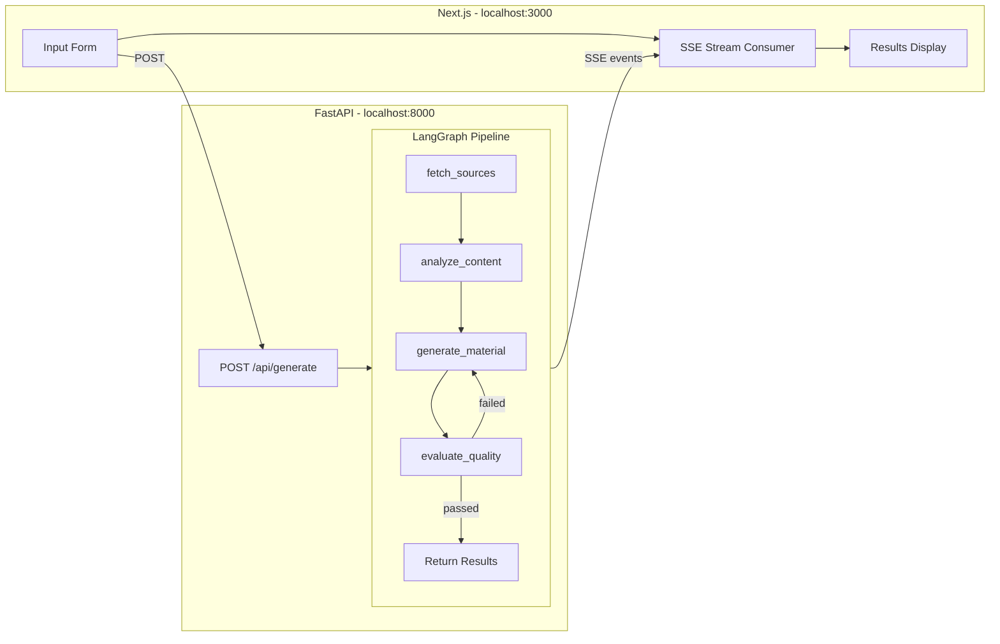

# ai-fullstack-app

A full-stack template for building **AI agentic loop** applications. The pattern: user input → external data fetch → AI analysis → content generation → automated quality evaluation → retry or return.

Ships with a working **Study Guide Generator** demo (Wikipedia + LLM) so you can clone, configure one API key, and run.

## Architecture



### Stack

| Layer | Tech |
|-------|------|
| Frontend | Next.js (App Router), TypeScript, Tailwind CSS, shadcn/ui, pnpm |
| Backend | FastAPI, Python 3.12+, LangGraph, langchain-core, uv |
| LLM | Claude (default), OpenAI (swap via env var) |
| Dev | Docker Compose, Makefile |
| CI | GitHub Actions |
| Deploy target | Vercel (frontend) + Railway (backend) |

## Quickstart

### Prerequisites

- Docker and Docker Compose
- An Anthropic API key (or OpenAI key)

### Steps

```bash
# 1. Clone and enter
git clone <your-repo-url> && cd ai-fullstack-app

# 2. Configure
cp .env.example .env
# Edit .env — set ANTHROPIC_API_KEY

# 3. Run
make dev
```

Open http://localhost:3000. Enter a topic, pick a format, hit Generate.

### Without Docker

```bash
# Backend
cd backend && uv sync --all-extras
uv run uvicorn app.main:app --reload --port 8000

# Frontend (separate terminal)
cd frontend && pnpm install && pnpm dev
```

## How to Customize

This template is designed to be forked and adapted. Here's what to change for your domain:

### 1. Data Source

Replace the `WikipediaFetcher` in `backend/app/services/data_fetcher.py`:

```python
class YourDataFetcher:
    async def fetch(self, topic: str, context: str) -> list[DataItem]:
        # Fetch from your API (Apify, Twitter, internal DB, etc.)
        ...
```

### 2. Domain Models

Edit `backend/app/models/schemas.py`:
- `GenerationRequest` — the fields your UI form collects
- `OutputFormat` / `DifficultyLevel` — your domain's enums
- `DraftEvaluation` — the quality criteria for your use case

### 3. Graph Nodes

Modify the prompts and logic in `backend/app/graph/nodes.py`:
- `analyze_content` — how source data is analyzed
- `generate_material` — what gets generated and in what format
- `evaluate_quality` — your quality criteria and scoring rubric

### 4. Frontend

Update `frontend/src/components/generation-form.tsx` to match your new request fields.

### 5. LLM Provider

Set `LLM_PROVIDER=openai` in `.env` and provide `OPENAI_API_KEY`. Update model names in `.env`:

```
GENERATION_MODEL=gpt-4o
EVALUATION_MODEL=gpt-4o-mini
```

## Project Structure

```
├── backend/
│   ├── app/
│   │   ├── api/routes.py          # HTTP endpoints
│   │   ├── graph/
│   │   │   ├── nodes.py           # LangGraph node functions
│   │   │   ├── pipeline.py        # Graph construction + SSE streaming
│   │   │   └── state.py           # Graph state definition
│   │   ├── models/schemas.py      # Pydantic models (shared contract)
│   │   ├── services/
│   │   │   ├── data_fetcher.py    # DataFetcher protocol + implementations
│   │   │   └── llm.py             # LLM provider factory
│   │   ├── config.py              # Settings via env vars
│   │   └── main.py                # FastAPI app
│   ├── tests/
│   ├── pyproject.toml
│   └── Dockerfile
├── frontend/
│   ├── src/
│   │   ├── app/page.tsx           # Main page
│   │   ├── components/            # Form, stream display, results
│   │   ├── hooks/                 # SSE stream hook
│   │   └── lib/                   # Types, API config
│   ├── package.json
│   └── Dockerfile
├── docker-compose.yml
├── docker-compose.override.yml    # Dev overrides (hot reload)
├── Makefile
├── .env.example
└── .github/workflows/ci.yml
```

## Available Commands

```bash
make help          # Show all commands
make setup         # First-time setup (install deps, copy .env)
make dev           # Start with Docker (hot reload)
make dev-backend   # Backend only (no Docker)
make dev-frontend  # Frontend only (no Docker)
make test          # Run backend tests
make lint          # Run all linters
make lint-fix      # Auto-fix lint issues
make clean         # Remove containers and build artifacts
```

## Deployment

### Vercel (Frontend)

1. Import the repo on Vercel
2. Set root directory to `frontend`
3. Set `NEXT_PUBLIC_API_URL` to your backend URL

### Railway (Backend)

1. Create a new project on Railway
2. Set root directory to `backend`
3. Add env vars from `.env.example`
4. Railway auto-detects the Dockerfile

## License

MIT
