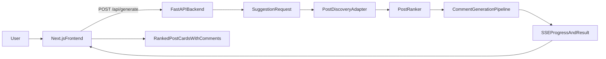
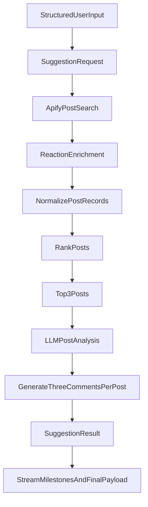

# Architecture

## Purpose
This app is a narrow MVP for improving a user's visibility on LinkedIn.

The product does three things in one run:
- collect structured user input about who the user is, what conversations they want to join, and how their comments should sound
- discover and rank relevant public LinkedIn posts via Apify-backed data collection
- generate three copy-ready comment drafts for each of the top three posts

The MVP deliberately stops there. It does not connect to a LinkedIn account, publish comments, schedule actions, or store user history.

## System Shape
The repository is split into:
- `frontend/`: a Next.js app that renders the single-page experience
- `backend/`: a FastAPI app that owns discovery, ranking, LLM prompting, and streamed progress/results
- `docs/`: source-of-truth technical documentation

## High-Level Flow

## Frontend Responsibilities
The frontend should present the product as one page with three clear sections:
1. Input
2. Scraping and analysis progress
3. Suggested posts and comments

The visual style should be editorial and polished rather than a generic admin dashboard. The shell can feel premium, but the core interaction must stay practical.

### Input Contract
The UI should collect structured inputs, not a single prompt box.

Required fields:
- `persona`: preset choices with a session-only custom override
- `topic`: preset choices with a session-only custom override
- `keywords`: include-only chips
- `tone`: four user-friendly sliders

Recommended tone labels:
- `Professional <-> Casual`
- `Reserved <-> Warm`
- `Measured <-> Bold`
- `Conventional <-> Fresh`

The frontend should preserve the user's input when a run fails so recovery does not require re-entering the form.

### Progress UX
The user should see concise milestones instead of raw internal logs.

The frontend progress card should collapse backend pipeline updates into three
user-facing milestones that match the product flow:
- `Discover relevant posts`
- `Score the shortlist`
- `Prepare final suggestions`

The backend may emit more granular streamed updates, but the default UI should
map them into these three labels instead of surfacing internal pipeline jargon.

Examples:
- `Searching public LinkedIn posts`
- `Scoring relevance and engagement`
- `Generating tailored comments`
- `Preparing your final suggestions`

If useful, the UI can expose deeper technical detail behind a secondary interaction, but that is not the primary experience.

### Output UX
The backend returns exactly three ranked posts.

Each post card should show:
- post author and preview text
- direct post URL
- visible engagement signals used in ranking
- a brief rationale for why the post was selected
- three copyable comment suggestions

## Backend Responsibilities
The backend remains the source of truth for discovery, ranking, generation, and graceful degradation.

### API Surface
Current template surface:
- `POST /api/generate`: starts one streamed run
- `GET /api/health`: basic health check

The MVP should continue to use a single streamed request for the main interaction. This keeps the frontend simple and fits the current template architecture.

### Core Modules
The product should be implemented around a few stable modules.

#### `SuggestionRequest` and `SuggestionResult`
Shared request/result contracts between frontend and backend.

These replace the template's educational fields like `output_format` and `difficulty` with LinkedIn-specific inputs and outputs.

#### `PostDiscoveryAdapter`
Wraps external Apify calls and normalizes raw responses into internal post records.

Responsibilities:
- build search parameters from persona, topic, and keywords
- collect candidate public posts
- enrich posts with reaction and engagement data when available
- return normalized records with stable fields the rest of the system can trust

This adapter should also be the first place to handle provider-specific failures, timeouts, and response oddities.

Current implementation details:
- post search uses `apimaestro/linkedin-posts-search-scraper-no-cookies`
- reaction enrichment uses `harvestapi/linkedin-post-reactions`
- reaction enrichment is intentionally capped to a configurable subset of candidate posts so the run stays fast enough for a single interactive request

#### `PostRanker`
Scores candidate posts using simple, testable logic.

The ranking rule for MVP is:
- relevance first
- engagement second

This logic should stay outside the LLM so it can be tested directly and tuned without prompt surgery.

Current implementation details:
- relevance is lexical and deterministic: topic, keywords, and persona are matched against post text, author headline, and hashtags
- engagement is a secondary tie-breaker based on reactions, comments, shares, and sampled reaction enrichment
- sorting is lexicographic by `(relevance_score, engagement_score, published_timestamp)` so engagement never overrides a materially more relevant post

#### `CommentGenerationPipeline`
Owns the fetch -> rank -> analyze -> generate flow using the existing streamed backend pipeline.

Responsibilities:
- call discovery
- rank and select the top three posts
- summarize enough post context for prompting
- generate three comments per selected post
- shape the final streamed result contract

The LLM should help with analysis and comment writing, not with basic record normalization or deterministic ranking.

## Error Handling Strategy
The MVP must fail like a grown-up product, not like a hackathon toy.

### Principles
- preserve user input on failure
- prefer partial results over blank failure when possible
- show errors in plain language
- keep provider-specific noise out of the main UI

### Failure Cases
#### Discovery failure
If Apify data collection fails completely:
- show a clear inline error state
- explain that public post discovery did not complete
- keep the input form intact for retry

#### Partial discovery
If fewer than three strong posts are available:
- return the best available posts
- tell the user the result is partial
- do not pretend the run was fully successful

#### Generation failure
If scraping succeeds but generation fails for one or more posts:
- keep successful post results
- mark missing comment sections explicitly
- provide a retry path instead of wiping the run

#### Malformed external data
The adapter should normalize aggressively and drop unusable records rather than letting bad payloads poison downstream steps.

## Data Flow Detail

## Testing Strategy
Tests should focus on external behavior and deterministic business logic, not prompt internals or styling trivia.

Priority areas:
- discovery adapter normalization and failure handling
- ranking behavior
- API contract and streamed result format
- minimal frontend form behavior for structured inputs
- end-to-end happy path producing three posts and three comments per post
- partial-result behavior when one stage degrades

Good tests assert:
- what request shape the system accepts
- what result shape the user receives
- which deterministic posts are selected given controlled inputs
- whether partial failures stay recoverable

Bad tests assert:
- incidental prompt wording
- implementation-only state updates
- pixel-perfect layout details

## Out Of Scope
Explicitly excluded from this MVP:
- LinkedIn authentication
- automatic posting or scheduling
- saved history or user accounts
- permanent admin-managed taxonomies for personas/topics
- heavy workflow branching or multi-step wizard state

## Why This Shape
This architecture keeps the product honest.

The UI stays simple.
The backend owns the hard decisions.
Ranking remains testable.
External provider mess is isolated.
The LLM is used where it adds leverage, not where it hides avoidable sloppiness.
